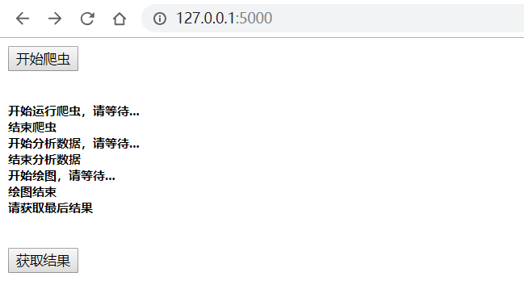
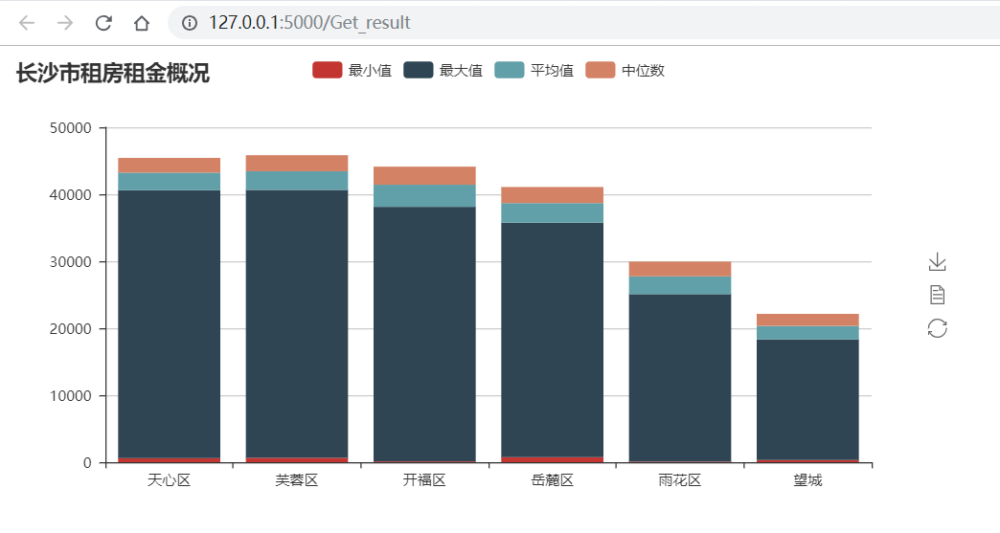
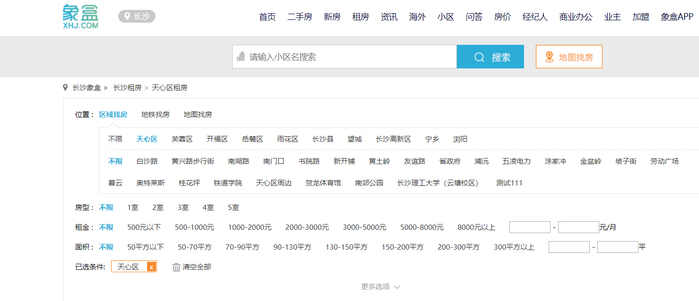
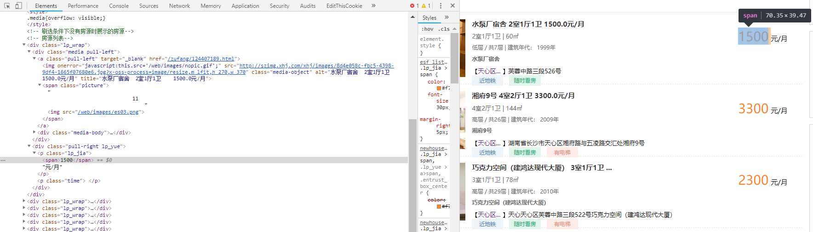

先抛出项目地址吧： [厦门大学数据库实验室](http://dblab.xmu.edu.cn/blog/2355/#more-2355)

### 项目简述

实现一个简单的交互式的租房信息分析展示 $web$ 平台。

数据来源 ： http://www.xhj.com/zufang/

**技术栈** ：

- $python$ 爬虫
- $pyspark$ 数据分析
- $flask$  $web$ 后端
- $pyecharts$  可视化

**最终呈现效果** ：





### 租房信息爬取

地址： http://www.xhj.com/zufang/



**网页分析**

#### 地址分析

在 *区域找房*  一栏找到长沙的各个区域。这里选取了长沙的六个区：【天心区、芙蓉区、开福区、岳麓区、雨花区、望城】

逐个点击 六个区可以观察到每个区域都对应有 $40$ 页 ，而且地址可以简单按下面这样方式拼接：

$http://www.xhj.com/zufang/ + 区域+/pg + 页码/$

所以代码中可以这样构造地址：

```
base_url = 'http://www.xhj.com/zufang/'
param = ['tianxinqu','furongqu','kaifuqu','yueluqu','yuhuaqu','wangcheng']
# region in param
url = base_url + region + '/pg%d/'%i # region为区域，i 为页码
```

这样很容易就可以通过两个循环来爬取我们需要的数据了。


#### 源码分析

通过开发者工具查看源码：



显然，这个网站的前端非常的给力，结构一目了然，而且没有动态加载。要是能改为 $ajax$ 的请求方式加载数据或许会更友好。

不用仔细观察都可以看见，每个租房信息都被一个 $<div$ $class="lp\_wrap">...</div>$ 包裹着。

我们很容易就可以通过 $xpath$ 定位到每个租房信息，像这样：

```
# html is the source code of webpage.
div = html.xpath('//*/div[@class="lp_wrap"]')
```

这样提取的 $div$ 对象为一个 $list$ 。最后将结果保存在 `rent_info.csv` 中。


#### 补充

经过这么一波并不花里胡哨的简单操作和分析，基本上可以写出对应的代码了。但是，这看似普普通通的网站，还是会封你的 $ip$ 的。所以，一般的加 `headers['User-Agent']​`  已经不行了。这里，我选择了添加代理来绕过它的反爬机制。【备注：很久之前爬过免费高匿代理存放在 `mongodb` 中】

(此处省略个几百字)一顿花里胡哨的操作后，数据库中的代理 $ip$ 果然已经基本失效了。毕竟一年多了。

后面发现，这个网站只会封你半分钟不到好像(应该是的，被禁后，刷新了好几下网页，然后刷回来了)。所以说，代码中是不是可以通过设置休眠时间来降低访问速度呢。三思过后，放弃的这个想法，这样的做法好像一点都不干脆利落。还是决定自己做个代理池算了。

于是开启了免费代理的寻找之路，又是一顿的花里胡哨操作后(此处省略几百字)。很多 **西刺代理** 这样的免费代理网站已经迭代升级了，不在是曾经那个亚子了。它也开始封我 $ip$ 了。差点当场炸裂开来……因为它不是封你一两分钟酱紫玩玩。

不过没关系，多爬几个这样的网站就可以有比较多得代理了。如果不想爬也不打紧，不妨逛一逛这里[小幻http代理](https://ip.ihuan.me/)  

支持批量提取，十分友好，可以帮我们省十几行代码了。

**一点建议**

记得用我们的目标网站测试一下这些免费代理是否失效。

**下面是我选出来的比较好的**

```
    proxies = [
        {'https':"https://221.6.201.18:9999"},
        {'http': 'http://39.137.69.9:80'},
        {'https': 'https://221.122.91.64:80'},
        {'http': 'http://39.137.69.8:8080'},
        {'http': 'http://125.59.223.27:8380'},
        {'http':'http://118.212.104.22:9999'},
        {'https':'https://47.106.59.75:3128'},
        {'http':'http://221.180.170.104:8080'},
        {'http': 'http://113.59.99.138:8910'},
        {'http':'http://123.194.231.55:8197'},
        {'https':'https://218.60.8.99:3129'},
        {'http': 'http://218.58.194.162:8060'},
        {'https': 'https://221.122.91.64:80'}
    ]
```


### pyspark 数据分析

这一步主要使用 `pyspark.sql.SparkSession` 来操作。从 `rent_info.csv` 中读取数据获得一个 `DataFrame` 对象，然后通过一系列动作(过滤筛选，聚合，统计)完成简单分析。


### flask 后端

使用 `flask_socketio.SocketIO`  来注册一个 `flask app` 对象。调用 `run` 方法启动服务。

```
app = Flask(__name__)
app.config['SECRET_KEY'] = 'xmudblab'
socketio = SocketIO(app)

if __name__ == '__main__':
    socketio.run(app, debug=True)
```

剩下的就是一些简单的路由配置(通过装饰器来实现)：

```
# 客户端访问 http://127.0.0.1:5000/，可以看到index界面
@app.route("/")
def handle_mes():
    return render_template("index.html")

# 对客户端发来的start_spider事件作出相应
@socketio.on("start_spider")
def start_spider(message):
    print(message)
    run_spider()
    socketio.emit('get_result', {'data': "请获取最后结果"})

# 对客户端发来的/Get_result事件作出相应
@app.route("/Get_result")
def Get_result():
    return render_template("result.html")
```


### socketio 补充

使用 `socketio ` 可以轻松实现 `web` 后台和前端的信息交互，这种连接是基于 `websocket` 协议的全双工通信。

前端 `socketio ` 库

```
<script src="static/js/socket.io.js"></script>
```

> 未完待续…..


### 改进空间

整个项目中，`spark` 的强大好像并没有发挥出来。毕竟 `spark` 在实时数据处理方面可是碾压 `mapreduce`的，好像一套组合拳，只使出了一点花拳绣腿。不妨大点想象一下，能不能实现一个实时房租信息交互系统，通过可视化工具在地图上直观的显示租房信息，每隔一小段时间更新数据，同时发送邮件提醒。甚至结合微信小程序在移动端也能查看。

嗯，想一想，挺好的。但是，这里的数据来源的可信度还有待考察。或许应该去 [贝壳找房](https://cs.zu.ke.com/zufang/changshaxian/) 看看(当事人非常后悔)。怎么开始就没想到去贝壳找。【不是打广告/手动滑稽】


---

